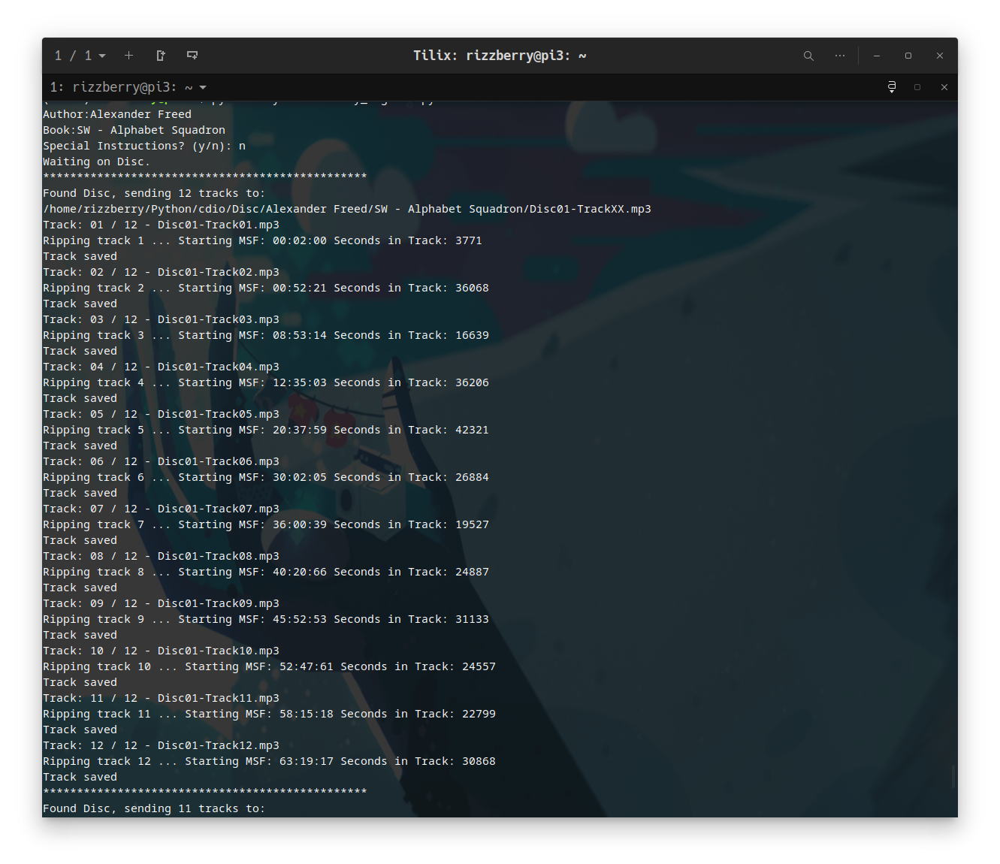

# CD-Cascade  
Made to preserve audiobooks  

### Prepare!!!
Using pycdio & pydub, so make sure you:   
`pip install pycdio, pydub`   
*and you'll need libcdio installed as well  

### Run!!!
This is CLI only, so you'll just run  
`py cd_cascade.py` / `python3 cd_cascade.py`

Place this into the directory you want your audiobooks to go in.  
They'll be organized by Author and Book Title.  

You'll just have to type Author and Book Title once, then just put the next disc in when the tray pops out. 

### Screenshot!!!

# ¡ <3 !